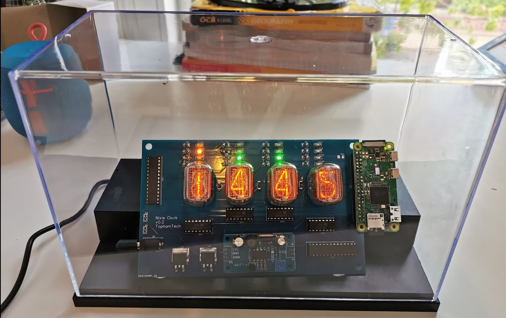
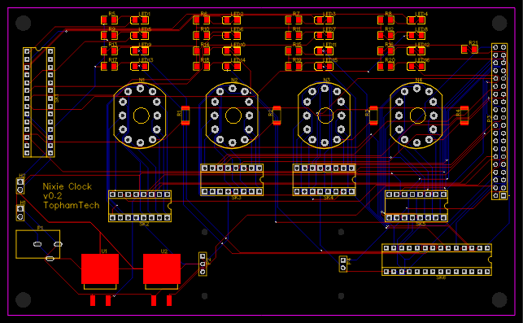

# Nixie Clock

## Intro

Nixie tubes are used for displaying digits, usually 0-9. They were used before LCD screens to create displays, and because of the way they work they have an awesome glow about them. This project uses original tubes (manufacturing dates from 1971-1979) to create a clock on a custom made PCB, with timers and LEDs for public transport alerting. Note, nixie tubes use ~180v to display the digits so this board deals with some high voltages, watch out!



 

## The Board

The board was designed by myself using a tool called EasyEDA then sent off to JLCPCB to be manufactured. This was fairly cheap (~$10 for 5 boards) and as the EasyEDA tool is made by JLC it integrates very nicely. All the files for the board are in the pcb folder. This includes the 2 json files that can be imported into EasyEDA to create a fully editable version of the board, as well as the gerber that was sent off for manufacturing. My advise would be to import into EasyEDA rather than using the gerber as this gives you more flexibility, and let's you adjust the silk screen so the board comes back with your name on it!



## The Components

The list of components used is in the pcb folder as BOM.xlsx (bill of materials). This contains all the part numbers used to create the board as purchased from LCSC Components, part of the same company as JLCPCB which made for very nice integration. It does not, however, include a number of extra components. 
* K155id1 or SN74141, both of these are the same and are used to drive the nixie tubes. Because the tubes aren't made anymore these weren't available on LCSC but were easy enough to find on eBay. 
* 12v 2a power supply. Any one will do provided it fits into the socket on the board.
* Raspberry Pi Zero W (and sd card) - this should be setup and working with any OS that can run the python program.

## The functionality

The board has a number of features and functions. 
* Firstly, it is a clock that shows the time as pulled from the Pi's datetime.now()
* Every 5 seconds it switches to the time until the bus arrives. This data is pulled from the TfL (Transport for London) API
* The LEDs show the status of the London underground, the 3 tube lines that we use the most. Again, this uses the TfL API that returns a number between 0 (all services working) - 9 (severe delays). It then displays green, yellow or red depending on this result. Each column of LEDs represents 1 tube line
* If an error with the clock occurs, it will display 9999
* If an error with the tube status's occurs, it will illuminate the blue LED

## The Code

main.py is the entry code, which has a continuous while loop. All board functionality has been extracted out into separate controllers.

### ledController.py 
Controls the LED's.
Called like so:

```ledController.writeLed('yellow',1,'off')```

where 'yellow' indicates the colour of the led, and can be either:
* yellow
* red
* green
* blue

where the number indicates the led column (1-4) with 1 being the left-most column

where the string 'off' represents the desired state of the led, and can either be:
* on 
* off

There are also some helper methods in that file. 
```ledController.clearAll()```

takes no arguments and turns off all LEDs


```ledController.writeCol(1,'off')```

where the number indicates the led column (1-4) with 1 being the left-most column

where the string 'off' represents the desired state of the led, and can either be:
* on 
* off

### tubeController.py
Controls the nixie tubes.

Called like so:

```tubeController.writeDigit('1234')```

where the string is the numbers to display on the nixie tubes. This should only be numbers 0-9 or the character '-' if the nixie tube should remain off. Regardless of the content, this should always be passed as a single, 4 character string

The tubes can also be individually addressed like so:

```tubeController.displayDigit(1,8)```

where the first number (1-4) indicates the nixie tube to be addressed with 1 being the leftmost tube

where the second number is the number to display (0-9) or the string 'off' if it is to remain off. NOTE: there is a discrepancy between 'off' here and '-' for writeDigit. This will be addressed in future.

### transportController.py

This contains the logic for calling the TfL APIs and suitably formatting and parsing the result. For more information about the apis, visit https://api.tfl.gov.uk/

## Running

Simply set up sudo python path/to/main.py to run on startup, and make sure the pi has an internet connection